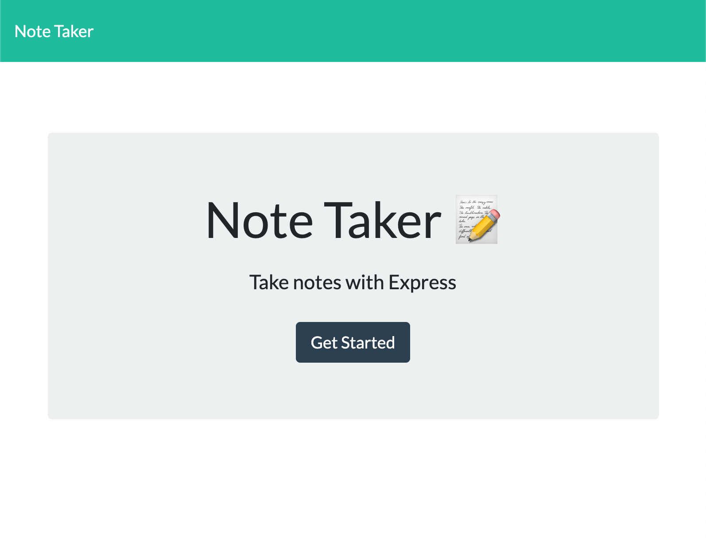
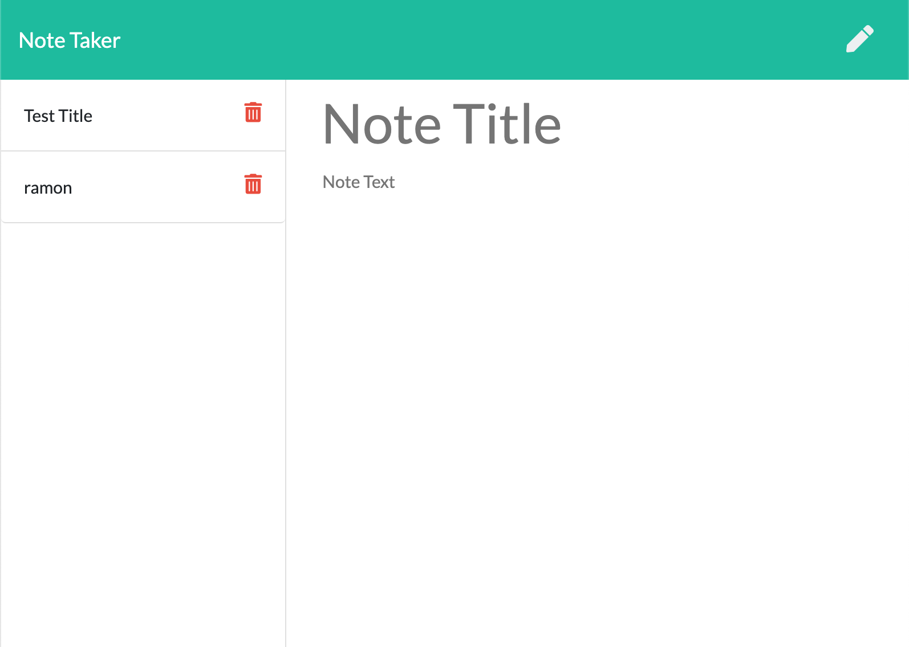

# Note Taker

> Application that can be used to write, save, and delete notes. This application will use an express backend and save and retrieve note data from a JSON file.

## Table of contents
* [General info](#general-info)
* [Screenshots](#screenshots)
* [Technologies](#technologies)
* [Setup](#setup)
* [Features](#features)
* [Status](#status)
* [Inspiration](#inspiration)
* [Contact](#contact)

## General info
For users that need to keep track of a lot of information, it's easy to forget or be unable to recall something important. Being able to take persistent notes allows users to have written information available when needed.

## Screenshots

## Technologies
* Node.js
* Express
* JavaScript
* CSS 3
* HTML 5

## Setup
This application runs in the browser. Nothing needs to be installed except for your default browser.

* Repository can be found here: [GitHub/ramonpbarros](https://github.com/ramonpbarros/note-taker) Make sure to git clone and check out the code!

## Code Examples
Show examples of usage:
`app.listen(PORT, () => {console.log("App listening to PORT: " + PORT);});`

## Features
List of features ready and TODOs for future development
* Awesome feature 1
* Awesome feature 2
* Awesome feature 3

To-do list:
* Wow improvement to be done 1
* Wow improvement to be done 2

## Status
Project is: _in progress_
* Make sure to check the application [here](https://vast-ridge-01378.herokuapp.com/).

## Inspiration
Project inspired by UCSD Coding Bootcamp, based on second month of course, applying Node.js, Express and JavaScript skills.

## Contact
Created by [@ramonpbarros](https://ramonpbarros.github.io/) - feel free to contact me!